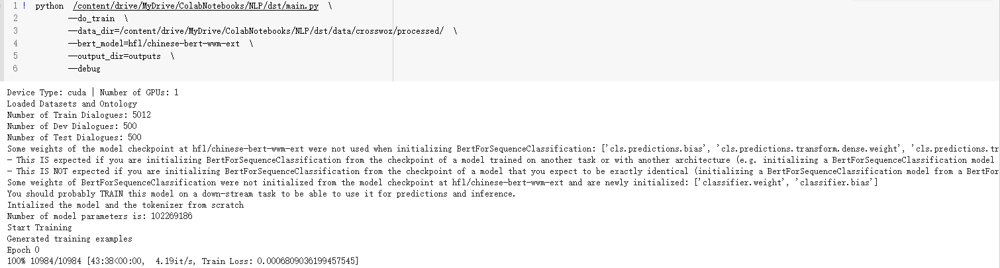

# dst
运行截图  
`python main.py --do_train --data_dir=data/crosswoz/processed/ --bert_model=hfl/chinese-bert-wwm-ext --output_dir=outputs`

前期在数据理解和处理成所需要的数据格式上花了很长时间  
TODO  
-[ ] 使用多进程提高数据处理速度
-[ ] 调整模型
-[ ] 使用DistilBert
